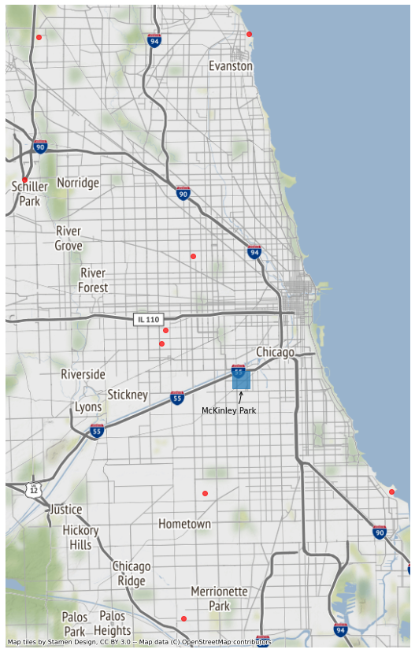

# Air-Quality
Exploring data-driven solutions for local environmental groups. 

## Getting Started
1. Obtain an EPA AirNow API key [here](https://docs.airnowapi.org/account/request/) and a PurpleAir API key by emailing contact@purpleair.com
1. Create a file called `.env` in the root directory. This file is ignored via the `.gitignore` file to avoid committing secrets.
1. Open `.env` in a text editor and add the following as the contents, replacing the second part with your personal API key:
```
EPA_KEY='REPLACE_ME_WITH_AIRNOW_API_KEY'
PURPLE_AIR_KEY='REPLACE_ME_WITH_PURPLE_AIR_API_READ_KEY'
```
1. set up a local environment using the requirements.txt file.

## AirNow Sensor Map


The map above highlights the lack of official air quality sensors in more urban and industrial areas of Chicago. This map can be created by running [src > visualization > map_airnow_sensors.py]('src/visualization/map_airnow_sensors.py')


## Questions to Explore
1. How well is the AirNow data correlated with more localized PurpleAir sensors?
    - Start with PurpleAir sensors in the vicinity of McKinley Park
1. Can we use open PurpleAir data to create more localized air quality reports and warnings?
1. Are the AirNow sensors equitably located?
    - Use Census or Social Vulnerability Index data

## Contributing
If you have a feature request or notice a bug, please add an [issue](https://github.com/Code-For-Chicago/Air-Quality/issues). If you would like to contribute to the code base, but are unsure how, please check out the [First Contributions](https://github.com/firstcontributions/first-contributions) repository.
