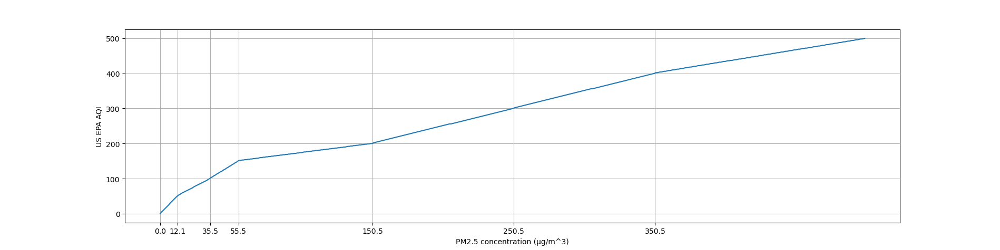

# Background on air quality

<!-- markdown-toc start - Don't edit this section. Run M-x markdown-toc-refresh-toc -->
**Table of Contents**

- [Background on air quality](#background-on-air-quality)
    - [Particulate matter](#particulate-matter)
    - [Measurement](#measurement)
        - [PurpleAir](#purpleair)
        - [EPA AirNow](#epa-airnow)
        - [Air quality index (AQI)](#air-quality-index-aqi)
            - [Example calculation](#example-calculation)
            - [Visualization of AQI calculation](#visualization-of-aqi-calculation)

<!-- markdown-toc end -->


## Particulate matter

The introduction to the Wikipedia page on
[Particulates](https://en.wikipedia.org/wiki/Particulates) has a lot of
interesting information and references.

Particulate matter can be natural or anthropogenic, and there are, of course,
many different types of particulate matter --- all solid or liquid matter
suspended in air. They are categorized by size. For instance, PM10 designates
particles of diameter 10μm or less, while PM2.5 designates particules of
diameter 2.5μm or less. Particulate matter is classifying as a group 1
carcinogen (by the WHO and the IARC, the international agency for research on
cancer), in that there is sufficient evidence of carcinogenic behavior in
humans. Typically the smaller the particulates, the greater the harm, as the
particles are able to more easily reach the bloodstream and brain.

European [studies](https://doi.org/10.1016/S1470-2045(13)70279-1) have shown
that there is no safe level of particulate matter and that for every increase of
10μg/m^3 in PM10 the lung cancer rate rose 22%. 
The numbers are worse for PM2.5, for which every increase of 5µg/m^3, the lung
cancer rate rose 18%. Indeed, the large body of data on air quality and cancer,
heart disease, etc. has allowed scientists to establish causal links between the
presence of particulate matter and certain causes of death (see
[here](https://www.stateofglobalair.org/sites/default/files/soga-2018-report.pdf),
for instance, on the burden of disease attributable to air pollution). 

Interestingly, the bulk of particulate matter on Earth, by mass, has natural
origins (such as sea salt and mineral dust from wind-driven ocean spray and
desert sandstorms). These natural sources comprise about 90% of particulate
matter, though they are typically larger in size than anthropogenic
particulates (see [here](https://earthobservatory.nasa.gov/features/Aerosols)).

## Measurement

We may consider the mixture of particulate matter and air as an aerosol --- that
is, an air-soution. Hence particulates are typically measured in micrograms per
cubic meter. But how do air quality sensors measure these concentrations? It
seems that the standard approach is, roughly, to see how much light scatters
when shined through air. The results of these scattering measurements are then
used to determine the concentration of particulates of various sizes.

To go into a bit more detail, how do these computations work? We might start by
considering the toy problem of a single spherical particle (of a size comparable
to the wavelength of the laser light being shined through the air). The solution
to Maxwell's equations in this setup is due to Mie in 1908 (and others).
Presumably these solutions can be used, when scaled up to the case of multiple
particles, to determine the number and size of the particulates. See
[Wikipedia](https://en.wikipedia.org/wiki/Mie_scattering) for a description of
Mie scattering. This is, however, not the only way to measure particulate
matter. Another technique is that of [beta
attenutation](https://en.wikipedia.org/wiki/Beta_attenuation_monitoring), in
which the particulate matter is caught some sort of material and beta radiation
is used to determine how much (and what type) was caught.

### PurpleAir
PurpleAir's sensors use Plantower's PMS5003 and PMS1003 sensors. These sensors
push air through a cavity in which a laser is shined and scattering
cross-sections are measured (as sketched above). See

- [manual](https://www.aqmd.gov/docs/default-source/aq-spec/resources-page/plantower-pms5003-manual_v2-3.pdf)
- [teardown](https://goughlui.com/2021/03/14/review-teardown-plantower-pms5003-laser-particulate-monitor-sensor/)

for some details on these particular sensors. Explanations of how a competitor's
sensors work are a bit more readily available:

- [sensiron](https://www.sensirion.com/en/about-us/newsroom/sensirion-specialist-articles/particulate-matter-sensing-for-air-quality-measurements/)

It seems, unfortunately, that the algorithms that these sensors use to analyze
the scattering data are proprietary. It would be interesting to see whether
there are companies that produce sensors equipped with free and open-source
algorithms. Sensirion, for instance, claims that their algorithms are more
discerning in terms of particulate matter that varies significantly in size.
They moreover claim that their sensors are protected from the overall buildup of
dust (which might otherwise bias the photocell's scattering measurements).
Thus it would not be surprising to find that different sensors give different
results (as the algorithms vary along with hardware) or that different sensor's
accuracies might drift at different rates.

PurpleAir tests the consistency of the Plantower sensors that they receive using
a smoke chamber test (see [here](https://www2.purpleair.com/pages/technology)), and have found no consistency issues. There is,
however, no mention of accuracy tests, say, comparing the Plantower sensors to
other laser particle sensors. This may be something to keep in mind when
comparing PurpleAir's data to other data using other laser sensors.

The Plantower sensors count suspended particles in sizes of 0.3, 0.5, 1.0, 2.5,
5.0, and 10µg. These counts are then apparently processed by PurpleAir sensors
"using a complex algorithm" to calculate the PM1.0, PM2.5, and PM10 mass
concentrations in µg/m^3. It is unclear why these counts need to be processed
via anything more than a simple algorithm --- perhaps to account for the
airflow, etc. unique to the PurpleAir sensors?

It is important to note that each PurpleAir sensor contains two Plantower
sensors, labelled A and B, for redundancy and consistency. The data shown on
PurpleAir's map can be viewed in various configurations. The default is "US EPA
PM 2.5 AQI". See below for some details on the definition of the AQI.

### EPA AirNow

Illinois has published a
[plan](https://www2.illinois.gov/epa/topics/air-quality/outdoor-air/air-monitoring/Documents/Draft%20Network%20Plan.pdf)
for its air monitoring in 2022. This document provides useful information about 
The 5 PM2.5 AirNow sensors whose data is analyzed in the notebook
[here](../notebooks/compare_airnow_and_purpleair_.ipynb) can be found in this
document. We reproduce some of the information here.

| Location         | Latitude | Longitude | Station Type | Monitor Type | Sampling Schedule | Spatial Scale | Owner | Site Description                 |
|------------------|----------|-----------|--------------|--------------|-------------------|---------------|-------|----------------------------------|
| Des Plaines      | 42.060   | -87.863   | SLAMS        | FEM Teledyne | Hourly            | Urban         | IEPA  | Regional Office Bldg.            |
| Springfield Pump | 41.913   | -87.722   | SLAMS, SPM   | Met One, BAM | 1/6, Hourly       | Neighborhood  | CCDES | Springfield Pump Station         |
| Cicero           | 41.864   | -87.749   | SLAMS, SPM   | AS, BAM      | 1/6, Hourly       | Neighborhood  | CCDES | Liberty School                   |
| Com Ed           | 41.751   | -87.713   | SLAMS, SPM   | Met One, BAM | 1/6, Hourly       | Neighborhood  | CCDES | Com Ed Maintenance Bldg. Trailer |
| Alsip            | 41.671   | -87.732   | SLAMS, SPM   | Met One, BAM | 1/6, Hourly       | Neighborhood  | CCDES | Village Garage                   |

We note some of the terms used in the table above:

- Station Type
  * SLAMS: State or Local Air Monitoring System.

    > SLAMS monitoring is for comparison to the NAAQS
  * SPM: Special Purpose Monitor.

    > The monitors in this category are included in the Agency network but do
    > not apply toward the determination of area NAAQS compliance
- Monitor Type
  * FEM Teledyne: Federal Equivalent Method Teledyne T640 Continuous (method 236)
  * Met One: MetOne sequential (method 545)
  * BAM: Beta Attenuation Monitor, Air Quality Index only (method 731)
  * AS: Andersen Sequential (method 155)
- Spatial Scale
  * Neighborhood:
  
    > Concentrations within some extended area of the city that has relatively
    > uniform land use with dimensions in the 0.5 to 4.0 km range
  
  * Urban:
  
    > Overall, citywide conditions with dimensions on the order of 4 to 50 kilometers
- Owner
  * [IEPA](https://www2.illinois.gov/epa/Pages/default.aspx)
  * [CCDES](http://blog.cookcountyil.gov/sustainability/)

For more details, refer to the document above.

One immediate thing to note is that some of these AirNow sensors are using
different technologies to monitor particulate matter. The Teledyne sensor, for
instance uses 90° white-light scattering (see Table 1-1
[here](https://www.teledyne-api.com/prod/Downloads/08354C%20T640%20USER%20MANUAL.pdf)),
which is similar to the technology used by the Plantower monitors in PurpleAir's sensors.
The other monitors use beta attentuation methods instead of lasers.

### Air quality index (AQI)

The US EPA's Office of Air Quality Planning and Standards has a helpful
[document](https://www.airnow.gov/sites/default/files/2020-05/aqi-technical-assistance-document-sept2018.pdf)
(dated September 2018) for understanding what exactly the AQI is and how it is
calculated.
The AQI is a scale consisting of integers in the range of 0 to 500. Values
computed greater than 500 are considered off the AQI scale (and health
recommendations align with the highest AQI category). Note that AQI is computed
for any given pollutant. That is, we may have a PM2.5 AQI as well as a PM10 AQI
or an ozone AQI. Any given AQI is computed by a method described on p. 9 of
the above link using the breakpoints defined in the table on p. 10.

#### Example calculation
Consider the following example. At the time of writing, PurpleAir shows a sensor
labelled "SASA_PA2_SL_W" at W 15th and Clark in the South Loop reporting a 24
hour average US EPA PM2.5 AQI of 55. We can use Equation 1 to estimate,
conversely, what the 24 hour PM2.5 concentration is (in µg/m^3).

1. First we note that an AQI of 55 falls into the "Moderate" (indicated by the
   color yellow) category. The table tells us that the PM 2.5 concentration must
   be between 12.1 and 35.4 µg/m^3.
2. Equation 1 is now written
   $$ 55 = \frac{100 - 51}{35.4 - 12.1} (C_{PM2.5} - 12.1) + 51 $$ 
3. Solving for $C_{PM2.5}$ yields a PM2.5 concentration of approximately 14

   µg/m^3.
Note that, within each breakpoint/category, the AQI is simply an affine scaling
of the pollutant concentration. Why the definition is as such, and why the
breakpoints are chosen as they are, is not described in the above document.

#### Visualization of AQI calculation
A quick visualization of how the PM2.5 concentration (in µg/m^3) translates to
the AQI index:

The code for producing this visualization is below.
```python
import math
import matplotlib.pyplot as plt

# these breakpoints are taken from the document above
breakpoints = [
    (0, 12),
    (12.1, 35.4),
    (35.5, 55.4),
    (55.5, 150.4),
    (150.5, 250.4),
    (250.5, 350.4),
    (350.5, 500.4)
]
aqi_breakpoints = [
    (0, 50),
    (51, 100),
    (101, 150),
    (151, 200),
    (201, 300),
    (301, 400),
    (401, 500)
]

# make sure the two lists are the same length
assert len(breakpoints) == len(aqi_breakpoints)

# returns the index of the breakpoint interval, if found
# returns -1 otherwise
def bin(conc: float):
    for i, interval in enumerate(breakpoints):
        if conc >= interval[0] and conc <= interval[1]:
            return i
    return -1

# converts PM2.5 ug/m^3 concentrations to AQI
def concentration_to_aqi(conc: float):
    # clamp value
    if conc < breakpoints[0][0]:
        conc = breakpoints[0][0]
    if conc > breakpoints[-1][1]:
        conc = breakpoints[-1][1]
    # bin into breakpoint interval
    interval = bin(conc)
    # if the concentration falls between breakpoint intervals,
    # simply overestimate slightly
    if interval == -1:
        interval = bin(conc + 0.1)
    # return aqi
    bphi = breakpoints[interval][1]
    bplo = breakpoints[interval][0]
    ihi = aqi_breakpoints[interval][1]
    ilo = aqi_breakpoints[interval][0]
    return math.ceil((ihi - ilo) / (bphi - bplo) * (conc - bplo) + ilo)

# plot
x = range(0, 500)
y = list(map(concentration_to_aqi, x))
plt.xlabel("PM2.5 concentration (µg/m^3)")
plt.ylabel("US EPA AQI")
plt.grid(True)
plt.xticks([a for (a,b) in breakpoints])
plt.plot(x, y)
plt.show()
```

